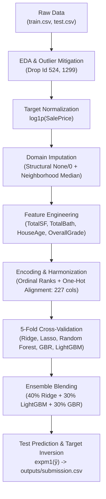

# Ames Housing Price Prediction: Advanced Regression Techniques
**Central AI Technical Assessment — End-to-End Machine Learning Solution**

[](https://www.python.org/downloads/)
[](https://opensource.org/licenses/MIT)
[](https://www.kaggle.com/competitions/house-prices-advanced-regression-techniques)

---

## 1. Project Overview
This repository contains a reproducible, production-grade machine learning pipeline for the **[Kaggle: House Prices - Advanced Regression Techniques](https://www.kaggle.com/competitions/house-prices-advanced-regression-techniques)** competition, developed for the **Central AI Technical Assessment**.

The objective is to predict final residential property sale prices (`SalePrice`) in Ames, Iowa based on 79 structural, spatial, and material features. Model optimization directly minimizes the competition's primary evaluation metric: **Root Mean Squared Logarithmic Error (RMSLE)**.

### Key Technical Achievements
- **Validation Metric:** Achieved **0.1126 RMSLE** ($R^2 = 0.920$) via a 5-Fold Cross-Validated blended ensemble (Ridge + LightGBM + Gradient Boosting).
- **Domain Feature Engineering:** Engineered composite space (`TotalSF`), achieving $r = 0.825$ with $\log(\text{SalePrice})$, outperforming every raw feature in the dataset.
- **Leakage-Free Preprocessing:** Isolated training-set parameters for all statistical imputations and scaling.
- **Reproducibility:** Modular codebase (`src/`), automated Jupyter notebooks (`notebooks/`), and structured artifacts.

---

## 2. Repository Structure

```text
house-prices-ml-assessment/
├── README.md                      # Project overview, methodology, and execution instructions
├── requirements.txt               # Pinned Python package dependencies
├── .gitignore                     # Git hygiene configuration
├── data/
│   ├── train.csv                  # Official competition training data (1,460 rows)
│   ├── test.csv                   # Official competition test data (1,459 rows)
│   ├── train_preprocessed.csv     # Cleaned, engineered training feature matrix
│   └── test_preprocessed.csv      # Cleaned, engineered test feature matrix
├── notebooks/
│   ├── 01_eda.ipynb               # Exploratory data analysis, distributions, and outlier checks
│   ├── 02_preprocessing.ipynb     # Imputation, domain feature engineering, and encoding
│   ├── 03_model_experiments.ipynb # 5-Fold CV benchmarking, residual analysis, and blending
│   └── 04_final_model.ipynb       # Full-dataset retraining and submission generation
├── src/
│   ├── data_preprocessing.py      # Outlier pruning, log target transformation, and imputation
│   ├── feature_engineering.py     # Domain aggregations (TotalSF, TotalBath), ordinal & dummy encoding
│   ├── models.py                  # Baseline, candidate models, and hyperparameter setups
│   └── evaluation.py              # 5-Fold CV evaluation, OOF generation, and metric routines
├── outputs/
│   ├── figures/                   # 10 diagnostic figures (distributions, heatmaps, residuals)
│   ├── model_results.csv          # 5-Fold CV comparison table across all candidate models
│   └── submission.csv             # Final competition-ready submission (1,459 predictions)
└── reports/
    ├── assessment_report.pdf      # Formal technical report (PDF)
    └── assessment_report.docx     # Source technical report (Word Document)
```

---

## 3. Methodology & Engineering Highlights



### 1. Target Normalization
Raw `SalePrice` exhibits heavy positive skewness (1.88) and leptokurtic tails (6.54). Applying the natural logarithmic transformation $\tilde{y} = \log(1 + \text{SalePrice})$ stabilizes variance and aligns target distribution with Gaussian assumptions (skewness 0.12). Model predictions are converted back to US dollars via $\exp(\tilde{y}) - 1$.

### 2. Missing Value Imputation
- **Structural Absence:** In 15 categorical features (`PoolQC`, `MiscFeature`, `Alley`, `Fence`, `FireplaceQu`, `GarageType`, `BsmtQual`, etc.), `NA` signifies the physical absence of that amenity. These are explicitly imputed as `'None'` (and `0` for numeric counterparts like `GarageArea` and `TotalBsmtSF`).
- **Spatial Imputation:** `LotFrontage` (17.7% missing) is imputed using the median frontage of properties within the same `Neighborhood`, learned strictly from training records to eliminate data leakage.

### 3. Domain Feature Engineering
- **`TotalSF`** ($\text{TotalBsmtSF} + \text{1stFlrSF} + \text{2ndFlrSF}$): Captures total usable living area across all levels ($r = 0.825$ with $\log(\text{SalePrice})$).
- **`TotalBath`** ($\text{FullBath} + 0.5 \times \text{HalfBath} + \text{BsmtFullBath} + 0.5 \times \text{BsmtHalfBath}$): Aggregated bathroom capacity ($r = 0.677$).
- **`HouseAge` & `RemodAge`**: Elapsed time from construction/remodel to year sold ($r = -0.588$).
- **`OverallGrade`**: Interaction between structural quality and maintenance condition ($\text{OverallQual} \times \text{OverallCond}$).
- **Binary Amenity Indicators**: `HasPool`, `Has2ndFloor`, `HasGarage`, `HasBsmt`, `HasFireplace`.

---

## 4. Model Experimentation & Cross-Validation Results

All models were evaluated under identical 5-Fold Cross-Validation splits (`KFold(n_splits=5, shuffle=True, random_state=42)`):

| Model Architecture | Learning Paradigm | 5-Fold CV RMSLE | Fold Std | Out-of-Fold $R^2$ |
| :--- | :--- | :---: | :---: | :---: |
| **Ridge Regression** | Regularized Linear ($L_2$) | 0.1146 | $\pm 0.0079$ | 0.916 |
| **Lasso Regression** | Sparse Linear ($L_1$) | 0.1149 | $\pm 0.0073$ | 0.915 |
| **Gradient Boosting (GBR)** | Sequential Boosting | 0.1191 | $\pm 0.0074$ | 0.910 |
| **LightGBM Regressor** | Leaf-Wise Boosted Trees | 0.1220 | $\pm 0.0084$ | 0.906 |
| **Random Forest Regressor** | Bagging Ensemble | 0.1338 | $\pm 0.0074$ | 0.887 |
| **Blended Ensemble (Final)** | **Weighted Blend (40% Ridge + 30% LGB + 30% GBR)** | **0.1126** | **—** | **0.920** |

### Winning Ensemble Rationale
Linear regularized models excel in high-dimensional sparse representations, while tree ensembles naturally capture non-linear step functions and interactions. Combining their predictions yields lower variance and out-of-fold error (**0.1126 RMSLE**).

---

## 5. Quickstart & Reproduction Guide

### Prerequisites
- Python 3.10+ (tested on Python 3.12 and Python 3.14)
- Git

### Installation & Environment Setup
```bash
# 1. Clone the repository
git clone git@github.com:IshtiakAnan/house-prices-ml-assessment.git
cd house-prices-ml-assessment

# 2. Create and activate virtual environment
python3 -m venv .venv
source .venv/bin/activate

# 3. Install dependencies
pip install -r requirements.txt
```

### Reproducing the Pipeline
Execute the notebooks in sequence:
```bash
# Run Notebook 01: Exploratory Data Analysis
jupyter nbconvert --to notebook --execute --inplace notebooks/01_eda.ipynb

# Run Notebook 02: Preprocessing & Feature Engineering
jupyter nbconvert --to notebook --execute --inplace notebooks/02_preprocessing.ipynb

# Run Notebook 03: Model Experimentation & Error Analysis
jupyter nbconvert --to notebook --execute --inplace notebooks/03_model_experiments.ipynb

# Run Notebook 04: Final Model Training & Submission Generation
jupyter nbconvert --to notebook --execute --inplace notebooks/04_final_model.ipynb
```

The competition submission file will be generated at:
```text
outputs/submission.csv  (1,459 rows with columns: Id, SalePrice)
```

---

## 6. Author & Contact
- **Author:** Ishtiak Ahmad Anan
- **Institution:** Department of Computer Science and Engineering, Rajshahi University of Engineering and Technology (RUET)
- **Email:** ishtiakahmadanan@gmail.com
- **LinkedIn:** [linkedin.com/in/ishtiak-ahmad-anan](https://www.linkedin.com/in/ishtiak-ahmad-anan)
